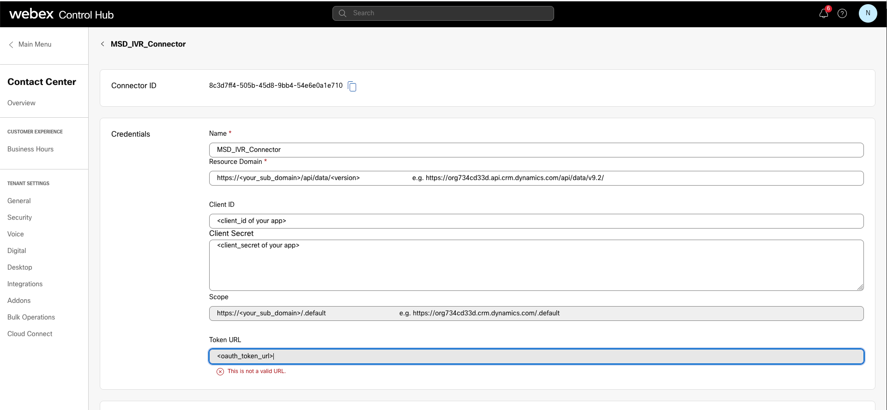
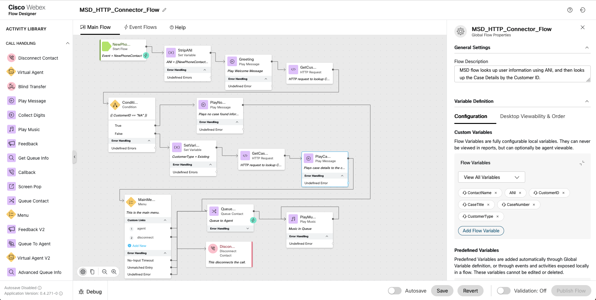
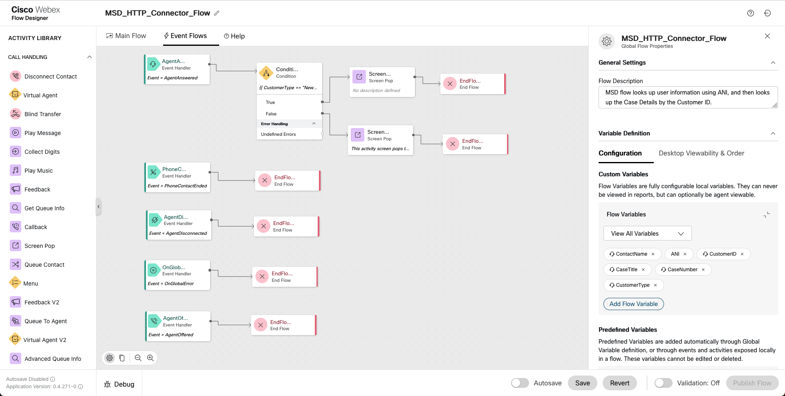

# Microsoft Dynamics 365 - IVR HTTP Connector

Reference assets for using the Webex Contact Center HTTP connector with Microsoft Dynamics 365 to perform IVR lookups, routing decisions, and screen pop actions. This folder includes a sample flow, a Postman collection, and screenshots of the sample setup.

## Included Assets

| Asset | Purpose |
| --- | --- |
| [`MSD_HTTP_Connector_Flow.json`](./MSD_HTTP_Connector_Flow.json) | Sample IVR flow showing Microsoft Dynamics 365 lookup behavior |
| [`Dynamics CRM - Sample REST APIs.postman_collection.json`](./Dynamics%20CRM%20-%20Sample%20REST%20APIs.postman_collection.json) | Postman collection for exploring the Microsoft Dynamics APIs used in the sample |
| [`images/`](./images/) | Connector configuration and flow screenshots |

## Watch The Setup Video

- [How to Configure MS Dynamics HTTP Connector on Webex Contact Center Flow Designer](https://app.vidcast.io/share/17b06533-8391-4327-b51f-0716076b8ea3)

## Use Case

- Customer calls into Webex Contact Center and is greeted while an ANI lookup is performed on Microsoft Dynamics 365.
- Based on ANI, customer details are fetched from the CRM.
- If the customer record does not exist, the call is transferred to an agent and a new case form opens in a new tab.
- If the customer record exists, a follow-up lookup retrieves the most relevant case details.
- The caller receives a personalized IVR experience and is prioritized based on incident severity.
- The call is routed to an agent and the latest case information is opened in a new browser tab.

## Prerequisites

- Create an application in Microsoft Dynamics CRM.
- Configure the Microsoft Dynamics connector with OAuth 2.0.
- In `admin.webex.com`, go to `Contact Center > Integrations > Connectors`, select `Custom Connector`, and set `Authentication Type = OAuth 2.0`.
- Import `MSD_HTTP_Connector_Flow.json` into Flow Designer.
- Update the connector name, queue name, audio files, and other flow-specific values before testing.

## Optional API Exploration

- Import `Dynamics CRM - Sample REST APIs.postman_collection.json` into Postman to explore the APIs used by the sample flow.
- These are the same APIs used inside Webex Contact Center Flow Designer to interact with Microsoft Dynamics 365.

## API References

- [Register an app with Azure Active Directory](https://learn.microsoft.com/en-us/power-apps/developer/data-platform/walkthrough-register-app-azure-active-directory)
- [Add app roles to your application](https://learn.microsoft.com/en-us/azure/active-directory/develop/howto-add-app-roles-in-azure-ad-apps)
- [OAuth 2.0 client credentials flow](https://learn.microsoft.com/en-us/azure/active-directory/develop/v2-oauth2-client-creds-grant-flow)
- [Manage application users in the Power Platform admin center](https://learn.microsoft.com/en-us/power-platform/admin/manage-application-users#view-or-edit-the-details-of-an-application-user)
- [Use Postman to perform operations with the Web API](https://learn.microsoft.com/en-us/power-apps/developer/data-platform/webapi/use-postman-perform-operations)

## Understanding The Sample Flow

### Section 1: IVR Lookup and Routing

- The IVR flow performs two HTTP lookups against Microsoft Dynamics 365.
- The first lookup gets the customer ID and customer name of the caller by ANI.
- The second lookup fetches case details associated with that caller by using the customer ID from the first request.

### Section 2: Screen Pop on Agent Answer

- This section uses Event Flows to screen pop either a new case form or the most recent case details in a new browser tab.
- The behavior differs depending on whether the caller is a new or existing customer.
- It demonstrates one way to drive Microsoft Dynamics 365 experiences from Flow Designer.

