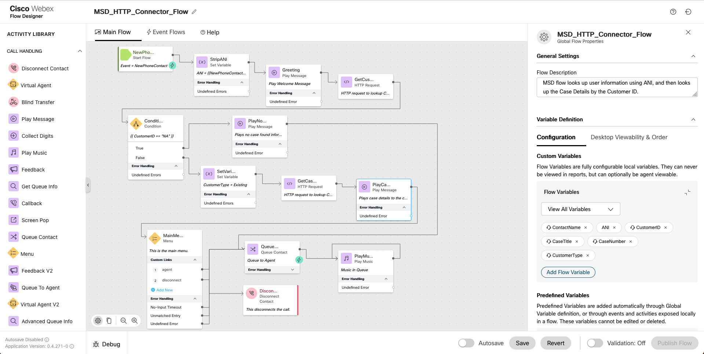

# Webex Contact Center - IVR HTTP Connector for MS Dynamics

The following section explains how to get started with the HTTP connector in Webex Contact Center that can interact with MS Dynamics CRM, extract information and make routing decisions accordingly. Since all HTTP verbs are supported, you can securely extract and update the contact / other object types inside of MS Dynamics with the help of this HTTP Connector.

**Attached**

- The sample flow for **MSD_HTTP_Connector_Flow.json** shows how a simple lookup can be performed in an IVR flow. For detailed steps, refer the video link given below.
- The Postman collection **Dynamics CRM - Sample REST APIs.postman_collection.json** can be directly imported into Postman to understand the MS Dynamics REST APIs.

## [How to Configure MS Dynamics HTTP Connector on Webex Contact Center Flow Designer]

## Use Case

- Customer calls into Webex Contact Center and is greeted while an ANI lookup is performed on MS Dynamics.
- Based on the ANI, customer details are fetched from the MS Dynamics CRM.
- If the customer record does not exist in the CRM, the call is transferred to the agent after playing a message. When the call is answered by the agent, a New Case Form opens in a new tab.
- If the customer record exists in the CRM, another lookup is performed to get the Case details for the customer (based on the Customer ID received from the previous request).
- Customer is greeted with a personalized IVR.
- Customer is prioritized based on Incident severity.
- The call is routed to an agent.
- Last created ticket information is popped in a new browser tab.

## Pre-Requisites

- An application created in Dynamics CRM
- Configuring the MS Dynamics connector using OAuth 2.0
  Login to admin.webex.com to configure the connector
  admin.webex.com > Contact Center > Integrations > Connectors > Select Custom Connector -> Authentication Type = OAuth 2.0
  Attached is the screenshot for reference.
- Import the attached flow MSD_HTTP_Connector_Flow.json inside flow designer.
- Change the connector name, queueName, audio files etc in the IVR Flow as per your configurations.
  Follow the tutorial video for end-to-end sample configurations.

**Optional**
To explore and understand which REST APIs are supported with MS Dynamics, import the simplified Postman collection. These are the same APIs that will be used inside of WebexCC Flow Designer to interact with MS Dynamics.

**MS Dynamics REST API Docs**

- [Register an app with Azure Active Directory](https://learn.microsoft.com/en-us/power-apps/developer/data-platform/walkthrough-register-app-azure-active-directory)
- [Add app roles to your application](https://learn.microsoft.com/en-us/azure/active-directory/develop/howto-add-app-roles-in-azure-ad-apps)
- [OAuth 2.0 client credentials flow](https://learn.microsoft.com/en-us/azure/active-directory/develop/v2-oauth2-client-creds-grant-flow)
- [Manage application users in the Power Platform admin center](https://learn.microsoft.com/en-us/power-platform/admin/manage-application-users#view-or-edit-the-details-of-an-application-user)
- [Use Postman to perform operations with the Web API](https://learn.microsoft.com/en-us/power-apps/developer/data-platform/webapi/use-postman-perform-operations)

## Understanding the Sample Flow

### Section 1 : IVR lookup and Routing

- Within the IVR flow, a look is performed in the MS Dynamics CRM.
- This script has 2 HTTP nodes inside the main flow.
- First lookup gets the Customer ID and Customer Name of the Caller from the MS Dynamics CRM using the ANI.
- Second lookup fetches the Case Details associated with that Caller using the Customer ID received from the previous request.

### Section 2 : Screenpop on agent answer

- This section uses Event Flows to screenpop :
  a - New Case Form, in a new browser tab when the call is answered, in case of a new customer.
  b - Last created case details, in a new browser tab when the call is answered, in case of an existing customer.
- This is just an example of what is possible to be done on the MS Dynamics CRM via the Flow Designer.

