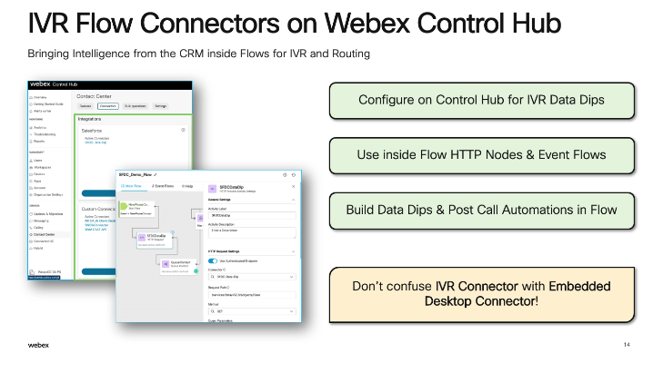
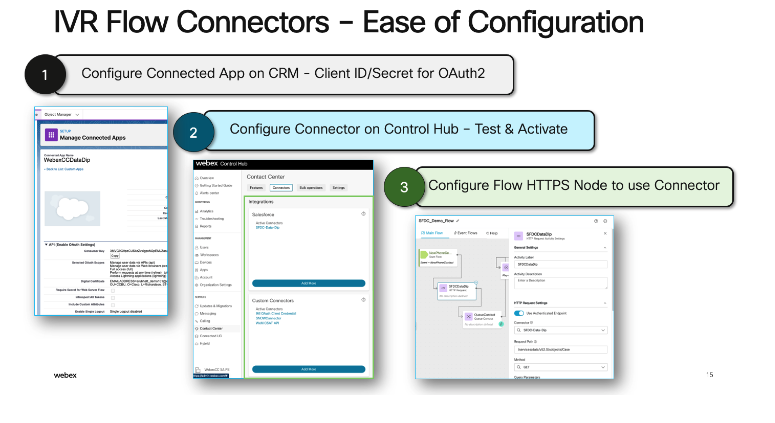
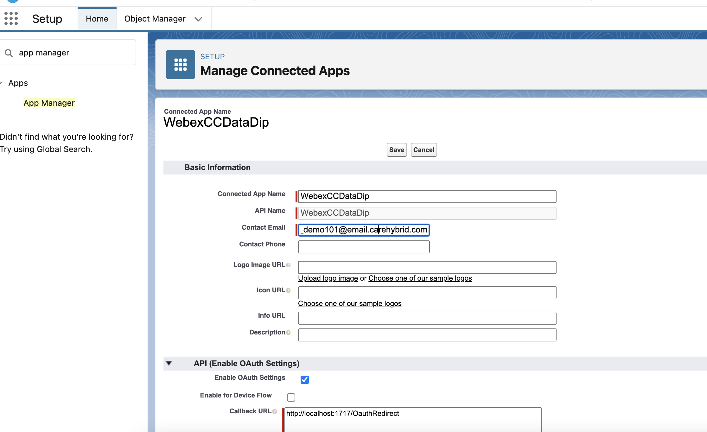
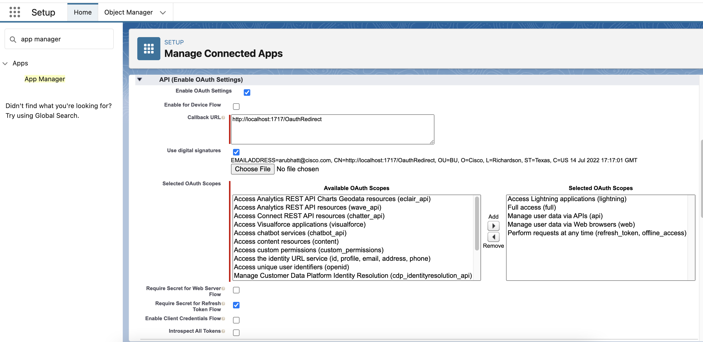
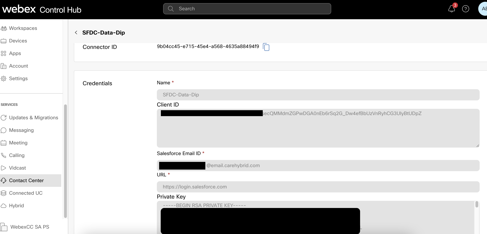
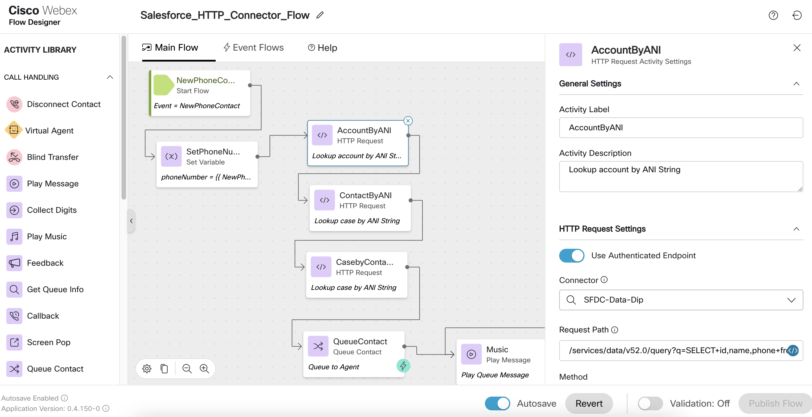
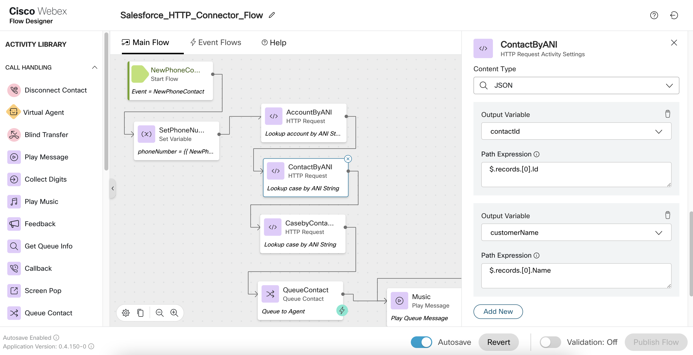
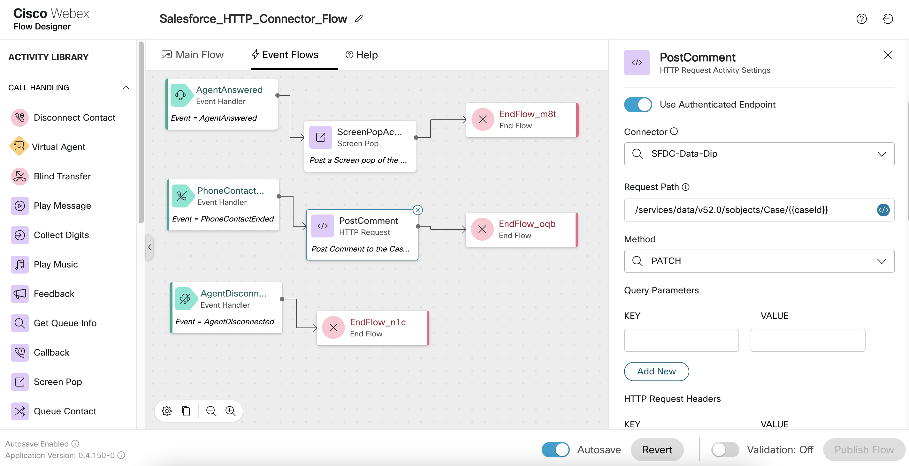

# Salesforce - IVR HTTP Connector


[](https://app.vidcast.io/share/51d8f1c7-f1ae-4963-97c2-73102a85fbf3)

Reference assets for using the Webex Contact Center HTTP connector with Salesforce to perform IVR lookups, routing decisions, and post-call case updates. This folder includes a sample flow, a Postman collection, and screenshots of the sample setup.

## Included Assets

| Asset | Purpose |
| --- | --- |
| [`Salesforce_HTTP_Connector_Flow.json`](./Salesforce_HTTP_Connector_Flow.json) | Sample IVR flow showing Salesforce lookup behavior |
| [`Salesforce_API_Collection.json`](./Salesforce_API_Collection.json) | Postman collection for exploring the Salesforce APIs used in the sample |
| [`images/`](./images/) | Connector configuration and flow screenshots |

## Watch The Setup Videos

- [Part 1 of 2: Configure Salesforce HTTP Connector](https://app.vidcast.io/share/51d8f1c7-f1ae-4963-97c2-73102a85fbf3)
- [Part 2 of 2: Configure Salesforce HTTP Connector](https://app.vidcast.io/share/82e9adf5-cd50-43ce-9ac4-3a34d7a23e03)

## Use Case

- Customer calls into Webex Contact Center and is greeted while an ANI lookup is performed on Salesforce.
- The Salesforce Case ID is looked up inside the CRM and related data is retrieved.
- The caller receives a personalized IVR experience.
- The call is prioritized based on a business parameter such as severity.
- The call is routed to an agent and the relevant information is screen popped.
- After the call, case comments and call identifiers are posted back to Salesforce by using Event Flows.





## Prerequisites

- Configure the Salesforce connector with OAuth 2.0 by following the videos above and the OAuth references below.
- In `admin.webex.com`, go to `Contact Center > Connectors`, select the out-of-box Salesforce connector card, and enter the OAuth 2.0 details shown in the video.
- Import `Salesforce_HTTP_Connector_Flow.json` into Flow Designer.
- Update the Webex Contact Center flow with your environment-specific details before testing.

## Optional API Exploration

- Import `Salesforce_API_Collection.json` into Postman to explore the Salesforce APIs used by the sample flow.
- These are the same APIs used inside Webex Contact Center Flow Designer to interact with Salesforce.
- To manually generate an access token for connector testing, use the sample CLI request below.

```sh
curl --location --request POST 'https://abcde-dev-ed.my.salesforce.com/services/oauth2/token' \
--header 'Content-Type: application/x-www-form-urlencoded' \
--data-urlencode 'grant_type=password' \
--data-urlencode 'client_id=clientId' \
--data-urlencode 'client_secret=clientSecret' \
--data-urlencode 'username=yourLogin@salesforce.com' \
--data-urlencode 'password=yourPassword'
```

## OAuth 2.0 Setup References

- [Webex Contact Center Salesforce connector configuration](https://help.webex.com/en-us/article/n26v7heb/Configure-Connected-App-for-Webex-Contact-Center-Salesforce-Connector)
- [Salesforce connected app configuration](https://developer.salesforce.com/docs/atlas.en-us.sfdx_dev.meta/sfdx_dev/sfdx_dev_auth_connected_app.htm)
- [Salesforce REST API introduction](https://developer.salesforce.com/docs/atlas.en-us.api_rest.meta/api_rest/intro_rest.htm)
- [Salesforce SOQL API reference](https://developer.salesforce.com/docs/atlas.en-us.api_rest.meta/api_rest/dome_query.htm)







## Understanding The Sample Flow

### Section 1: IVR Lookup and Routing

- This flow uses Salesforce IVR lookup inside the main flow.
- The script contains two HTTP lookup nodes.
- The first lookup fetches the user record by ANI.
- The second lookup fetches the current active case for that user.





### Section 2: Posting Call Information to Salesforce

- This section uses Event Flows to post information when the agent answers the call and when the agent ends the call.
- It shows one example of how Flow Designer can update Salesforce records after the interaction.


