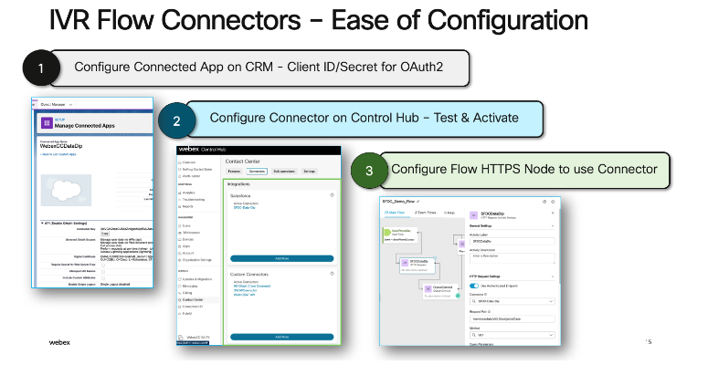

# Webex Contact Center - IVR HTTP Connector for Salesforce

The following section explains how to get started with the HTTP connector in Webex Contact Center that can interact with Salesforce to make routing decisions, and extract information from Salesforce. Since all HTTP verbs are supported, you can securely extract and update Incident/ other object types inside of Salesforce.

**Attached**

- The sample flow for **Salesforce_HTTP_Connector.json** which shows you how a simple lookup can be performed. For detailed steps, refer to the video below.
- The Postman collection **Salesforce_API_Collection.json** that can be directly imported into Postman to understand the Salesforce REST APIs.

## Watch the 2 Part series below

### [VIDEO: Part 1 of 2: Configure Salesforce HTTP Connector](https://app.vidcast.io/share/51d8f1c7-f1ae-4963-97c2-73102a85fbf3)

### [VIDEO: Part 2 of 2: Configure Salesforce HTTP Connector](https://app.vidcast.io/share/82e9adf5-cd50-43ce-9ac4-3a34d7a23e03)

## Official Documentation

**Salesforce Connector: https://help.webex.com/en-us/article/n26v7heb/Configure-Connected-App-for-Webex-Contact-Center-Salesforce-Connector**

**Connected App Configuration: https://developer.salesforce.com/docs/atlas.en-us.sfdx_dev.meta/sfdx_dev/sfdx_dev_auth_connected_app.htm**

## Use Case

- Customer calls into Webex Contact Center and is greeted while an ANI lookup is performed on Salesforce.
- From Webex Contact Center, the Salesforce Case ID is looked up inside of the CRM and data is extracted.
- Customer is greeted with a personalized IVR.
- Customer is prioritized based on some parameter, e.g severity.
- An Agent is routed the call.
- This information is popped onto the Agent Desktop for view.
- Post call, information about the call, case comments, including call identifiers - is posted to Salesforce by Webex Contact Center using Event Flows as a case comment.




## Pre-Requisites

- Configuring the Salesforce connector using OAuth2. Follow the above Video link to enable the REST API. Look below for the OAuth2 settings.
- Login to admin.webex.com and configure the connector details -> admin.webex.com > Contact Center > Connectors > Select Custom Connector -> OAuth2: Enter the details as per the video.
- Import the attached flow Salesforce_HTTP_Connector.json inside flow designer.
- Configure the WebexCC Flow along with the required details inside the flow.

**Optional**

> To explore and understand what REST APIs are supported with Salesforce, import the simplified Postman collection - **Salesforce_API_Collection.json**.

> These are the same APIs that will be used inside of WebexCC Flow Designer to interact with Salesforce

> To manually generate the access Token to test out the connector, you can use teh CLI command:

```sh
curl --location --request POST 'https://abcde-dev-ed.my.salesforce.com/services/oauth2/token' \
--header 'Content-Type: application/x-www-form-urlencoded' \
--data-urlencode 'grant_type=password' \
--data-urlencode 'client_id=clientId' \
--data-urlencode 'client_secret=clientSecret' \
--data-urlencode 'username=yourLogin@salesforce.com' \
--data-urlencode 'password=yourPassword'
```

**Salesforce REST API Docs**

- Salesforce REST API:
- Salesforce Table API:

## OAuth2 Settings - Salesforce


## Understanding the Sample Flow

### Section 1 : IVR lookup and Routing

- This uses the Salesforce IVR Lookup within the flow.
- The script has 2 HTTP Lookup nodes inside the main flow.
- The first lookup fetches the System ID of the User using the ANI.
- The second lookup fetches the current active incident of this user using the Incident Table REST API Query.


### Section 2 : Posting Webex Contact Center call information to the incident

- This section uses Event Flows to post information to the incident just when the agent answers the call, and when the agent ends the call.
- This is just an example of what is possible on the Salesforce Incident via the Flow Designer.


