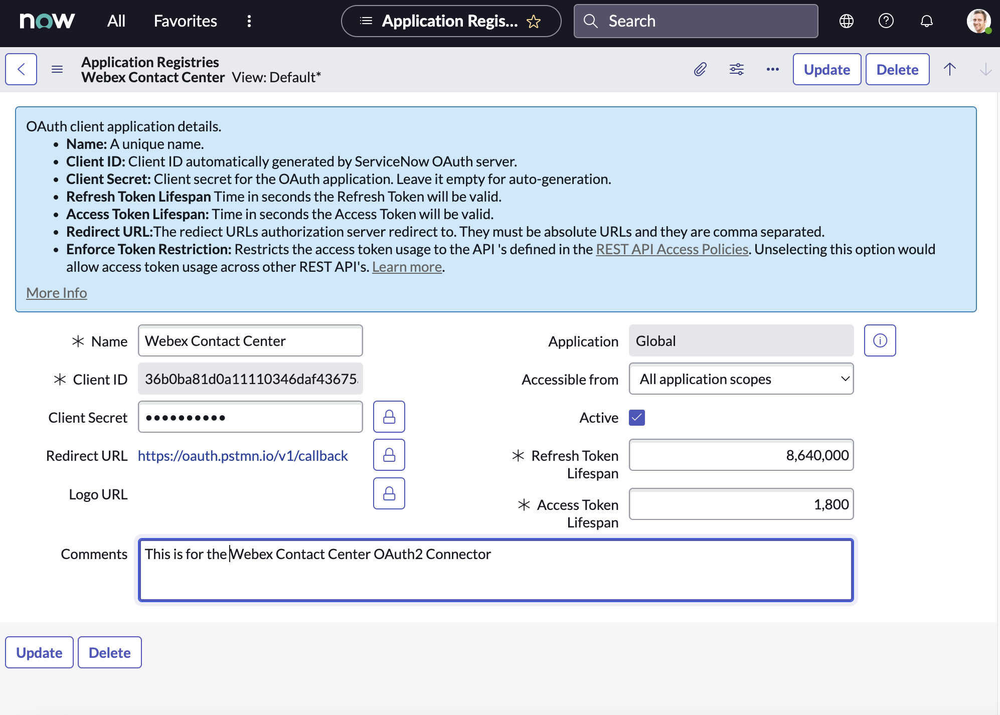

# ServiceNow - Webex Contact Center Legacy Connector

)

Legacy Version 1 desktop layout assets for the ServiceNow embedded Webex Contact Center Agent Desktop. This folder includes the primary layout package, ServiceNow update sets, the Actions Widget bundle, and a companion IVR HTTP connector reference package.

> Latest desktop layout: [`ServiceNow_Desktop_0.1.0_v4.0.1.json`](./ServiceNow_Desktop_0.1.0_v4.0.1.json)
>
> Primary update set: [`webexcc-servicenow-update-setv7-1.xml`](./webexcc-servicenow-update-setv7-1.xml)
>
> Optional bundle: [ActionsWidget](./ActionsWidget/)
>
> Official guide: [Integrate Webex Contact Center with ServiceNow (Version 1-Legacy)](https://help.webex.com/en-us/article/54vvw/Integrate-Webex-Contact-Center-with-ServiceNow-(Version-1%E2%80%94Legacy))

## Quick Links

| Asset | Purpose |
| --- | --- |
| [`ServiceNow_Desktop_0.1.0_v4.0.1.json`](./ServiceNow_Desktop_0.1.0_v4.0.1.json) | Main ServiceNow desktop layout package |
| [`webexcc-servicenow-update-setv7-1.xml`](./webexcc-servicenow-update-setv7-1.xml) | ServiceNow update set for the connector |
| [ActionsWidget/](./ActionsWidget/) | Optional widget-enabled bundle and update set |
| [IVR HTTP connector bundle](./servicenow-ivr-http-connector/README.md) | Sample flow, Postman collection, screenshots, and connector notes |

## Preview

## Configuration Notes

- Update the ServiceNow system properties after installation so they point to the desktop URL for your Webex Contact Center datacenter.
- `screenpopOnConnected` controls whether screen pop happens during the ringing event or after the call connects.
- The `ActionsWidget/` directory contains a newer optional bundle that extends the base connector package.

## Desktop URLs by Datacenter

The desktop URLs must be edited after installation using the official guide. Update the ServiceNow system properties so they point to the correct agent desktop URL for your tenant.

| Desktop URL | Datacenter |
| --- | --- |
| `https://desktop.wxcc-us1.cisco.com` | North America |
| `https://desktop.wxcc-eu1.cisco.com` | UK |
| `https://desktop.wxcc-eu2.cisco.com` | EU |
| `https://desktop.wxcc-anz1.cisco.com` | APJC |

## Layout Properties

The following section describes the properties in the layout and their utility in turning on certain features.

| #   | Layout Property      | Description                                                                                   | Functionality                                                                                         |
| --- | -------------------- | --------------------------------------------------------------------------------------------- | ----------------------------------------------------------------------------------------------------- |
| 1   | outDialAni           | Override the Outdial ANI specified for click to dial                                          | Optional field. The default Outdial ANI set on the tenant or agent profile will be used.             |
| 2   | screenpopCadName     | CAD variable name that has the value to be searched in CRM                                    | Mandatory field for advanced search. If no value is provided, screen pop is based on ANI search.     |
| 3   | cadToCrmFieldMapping | CAD variable name that can be stored in CRM logs, for example `CadName1:SnowField1`           | Optional field.                                                                                       |
| 4   | crmLibPath           | Do not change                                                                                 | Mandatory field.                                                                                      |
| 5   | screenpopOnConnected | Open screen pop on ringing or connected. If true, screen pop opens on connected. Otherwise it defaults to the ringing event. | Optional field.                                                                                       |

## Feature Matrix

This section outlines the features available in the standard connector as well as customizations that can be enabled on the desktop layout.

| #   | Feature | Standard Connector |
| --- | --- | --- |
| 1   | Auto-login of agents into Contact Center platform (SSO) | ✔️ |
| 2   | Call controls embedded in CRM application | ✔️ |
| 3   | Screen pop based on incoming call parameters (no record match) | ✔️ |
| 4   | Screen pop based on incoming call parameters (single record match - ANI) | ✔️ |
| 5   | Screen pop based on incoming call parameters (multiple record match - ANI) | ✔️ |
| 6   | Advanced screen pop based on incoming call parameters (for example CAD variables) | ✔️ |
| 7   | Outbound calling - click to call | ✔️ |
| 8   | Outbound support | ✔️ |
| 9   | Automatic call activity logging in CRM | ✔️ |
| 10  | IVR data populated within ServiceNow (caller-entered digits captured as CAD variables) | ✔️ |
| 11  | Contact Center reporting within the CRM | ✔️ |

## Additional Resources

- [ServiceNow IVR HTTP connector README](./servicenow-ivr-http-connector/README.md)

## Support

- Open a case with [Cisco TAC](https://cisco.com/go/tac).
- Ask questions in the [Cisco Developer Community for Webex Contact Center](https://community.cisco.com/t5/contact-center/bd-p/j-disc-dev-contact-center).
