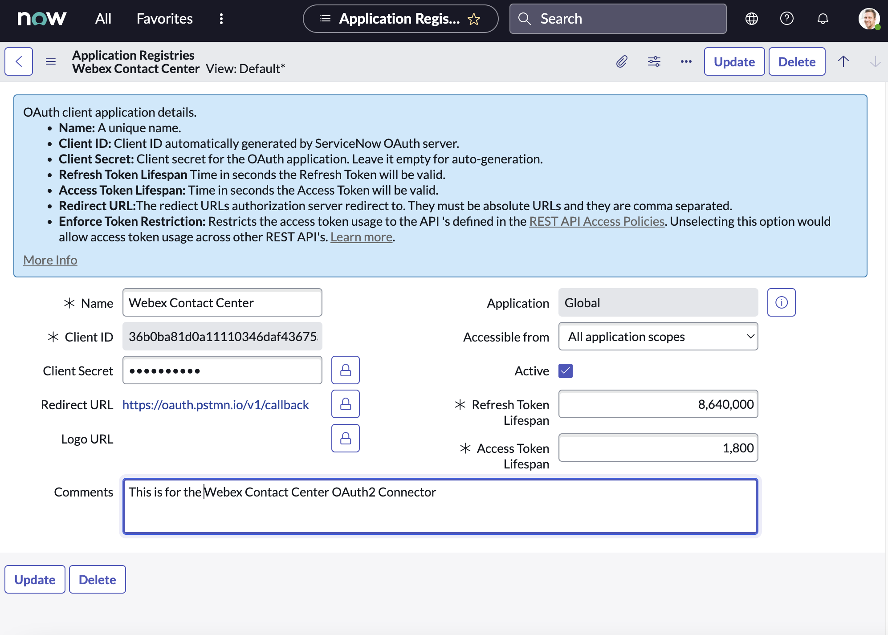
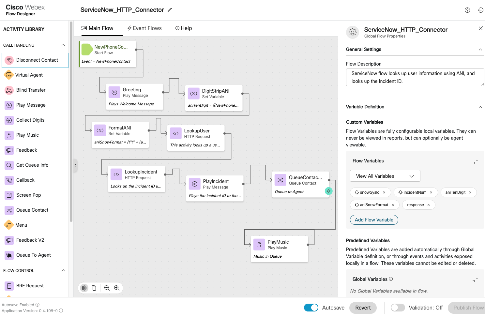
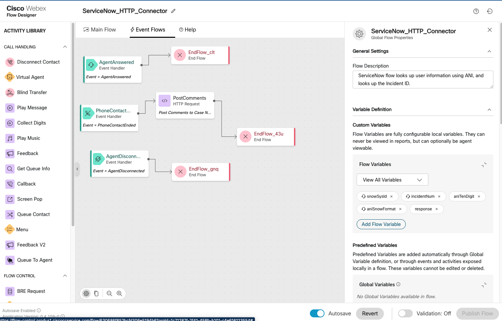

# Webex Contact Center - IVR HTTP Connector for ServiceNow

The following section explains how to get started with the HTTP connector in Webex Contact Center that can interact with ServiceNow to make routing decisions, and extract information from ServiceNow. Since all HTTP verbs are supported, you can securely extract and update Incident/ other object types inside of ServiceNow.

**Attached** 

- The sample flow for **ServiceNow_HTTP_Connector.json** which shows you how a simple lookup can be performed. For detailed steps, refer to the video below.
- The Postman collection **ServiceNow API Collection.postman_collection.json** that can be directly imported into Postman to understand the ServiceNow REST APIs.

## [Watch Now: Configure ServiceNow HTTP Connector on Webex Contact Center Flow Designer](https://app.vidcast.io/share/22e511b2-cb81-474d-a6c6-982214d0e473)

## Use Case

- Customer calls into Webex Contact Center and is greeted qhile an ANI lookup is performed on ServiceNow.
- From Webex Contact Center, the ServiceNow Incident ID is looked up inside of the CRM and data is extracted.
- Customer is greeted with a personalized IVR.
- Customer is prioritized based on Incident severity.
- An Agent is routed the call.
- This information is popped onto the Agent Desktop for view.
- Post call, information about the call, including call identifiers - are posted by Webex Contact Center using Event Flows.

## Pre-Requisites

- Configuring the ServiceNow connector using OAuth2. Follow the above Video link to enable the REST API. Look below for the OAuth2 settings.
- Login to admin.webex.com and configure the connector details -> admin.webex.com > Contact Center > Connectors > Select Custom Connector -> OAuth2: Enter the details as per the video.
- Import the attached flow ServiceNow_HTTP_Connector.json inside flow designer.
- Configure the WebexCC Flow along with the required details inside the flow.

**Optional** 
To explore and understand what REST APIs are supported with ServiceNow, import the simplified Postman collection. These are the same APIs that will be used inside of WebexCC Flow Designer to interact with ServiceNow

**ServiceNow REST API Docs**

- ServiceNow REST API: https://docs.servicenow.com/bundle/paris-application-development/page/integrate/inbound-rest/concept/c_RESTAPI.html
- ServiceNow Table API: https://developer.servicenow.com/dev.do#!/reference/api/sandiego/rest/c_TableAPI

## OAuth2 Settings - ServiceNow

## Understanding the Sample Flow

### Section 1 : IVR lookup and Routing

- This uses the ServiceNow IVR Lookup within the flow.
- The script has 2 HTTP Lookup nodes inside the main flow.
- The first lookup fetches the System ID of the User using the ANI.
- The second lookup fetches the current active incident of this user using the Incident Table REST API Query.

### Section 2 : Posting Webex Contact Center call information to the incident

- This section uses Event Flows to post information to the incident just when the agent answers the call, and when the agent ends the call.
- This is just an example of what is possible on the ServiceNow Incident via the Flow Designer.

