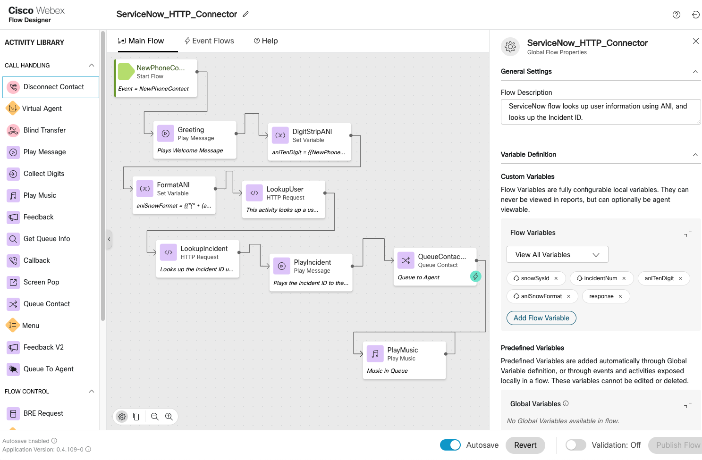
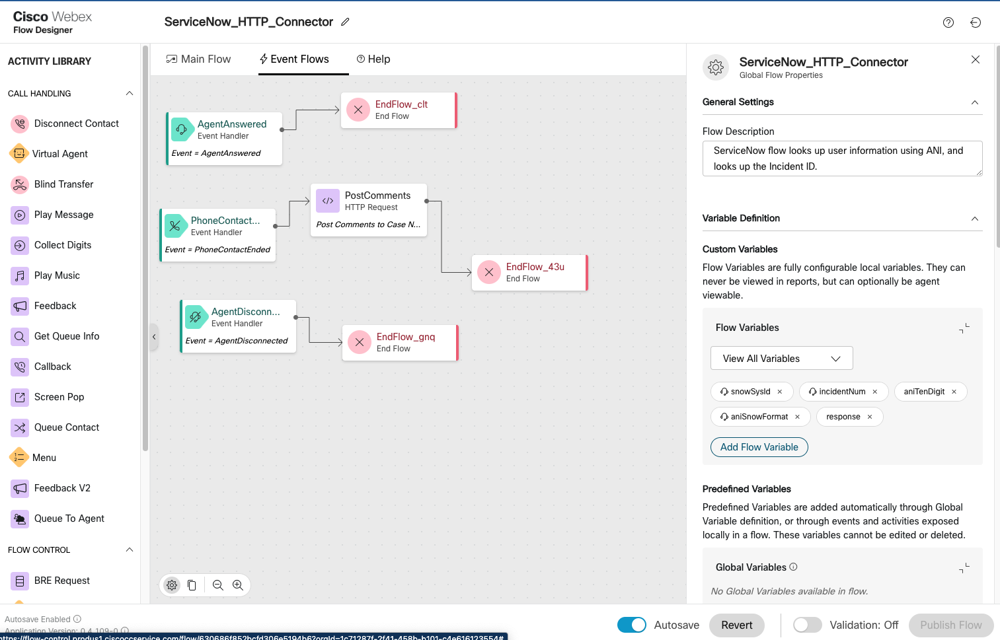

# ServiceNow - IVR HTTP Connector

Reference assets for using the Webex Contact Center HTTP connector with ServiceNow to perform IVR lookups, routing decisions, and post-call incident updates. This folder includes a sample flow, a Postman collection, and screenshots of the sample setup.

## Included Assets

| Asset | Purpose |
| --- | --- |
| [`ServiceNow_HTTP_Connector.json`](./ServiceNow_HTTP_Connector.json) | Sample IVR flow showing ServiceNow lookup behavior |
| [`ServiceNow API Collection.postman_collection.json`](./ServiceNow%20API%20Collection.postman_collection.json) | Postman collection for exploring the ServiceNow APIs used in the sample |
| [`images/`](./images/) | Connector configuration and flow screenshots |

## Watch The Setup Video

- [Configure ServiceNow HTTP Connector on Webex Contact Center Flow Designer](https://app.vidcast.io/share/22e511b2-cb81-474d-a6c6-982214d0e473)

## Use Case

- Customer calls into Webex Contact Center and is greeted while an ANI lookup is performed on ServiceNow.
- The ServiceNow incident ID is looked up inside the CRM and related data is retrieved.
- The caller receives a personalized IVR experience.
- The call is prioritized based on incident severity.
- The call is routed to an agent and the relevant information is screen popped.
- After the call, call details and identifiers are posted back through Event Flows.

## Prerequisites

- Configure the ServiceNow connector with OAuth 2.0 by following the setup video.
- In `admin.webex.com`, go to `Contact Center > Connectors`, select `Custom Connector`, and enter the OAuth 2.0 details shown in the video.
- Import `ServiceNow_HTTP_Connector.json` into Flow Designer.
- Update the Webex Contact Center flow with your environment-specific details before testing.

## Optional API Exploration

- Import `ServiceNow API Collection.postman_collection.json` into Postman to explore the ServiceNow APIs used by the sample flow.
- These are the same APIs used inside Webex Contact Center Flow Designer to interact with ServiceNow.

## API References

- [ServiceNow REST API](https://docs.servicenow.com/bundle/paris-application-development/page/integrate/inbound-rest/concept/c_RESTAPI.html)
- [ServiceNow Table API](https://developer.servicenow.com/dev.do#!/reference/api/sandiego/rest/c_TableAPI)

## OAuth 2.0 Setup

## Understanding The Sample Flow

### Section 1: IVR Lookup and Routing

- This flow uses ServiceNow IVR lookup inside the main flow.
- The script contains two HTTP lookup nodes.
- The first lookup fetches the system ID of the user by ANI.
- The second lookup fetches the current active incident for that user by using the incident table REST API query.

### Section 2: Posting Call Information to ServiceNow

- This section uses Event Flows to post information when the agent answers the call and when the agent ends the call.
- It shows one example of how Flow Designer can update ServiceNow incident records after the interaction.

