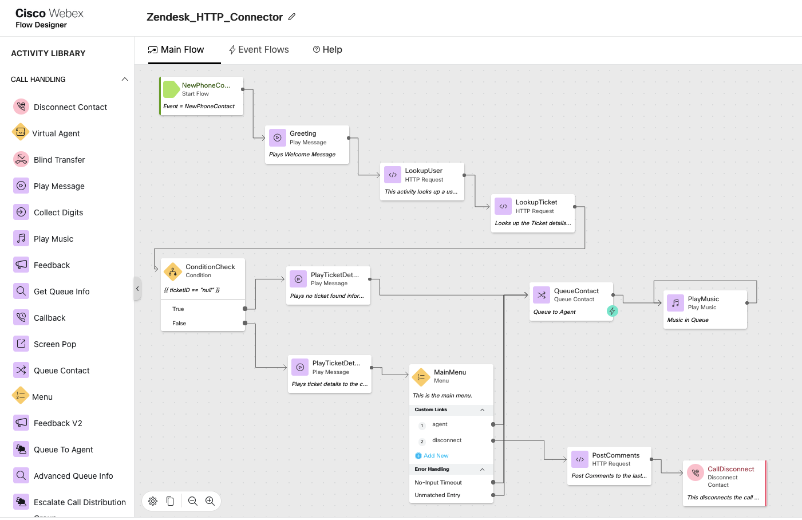
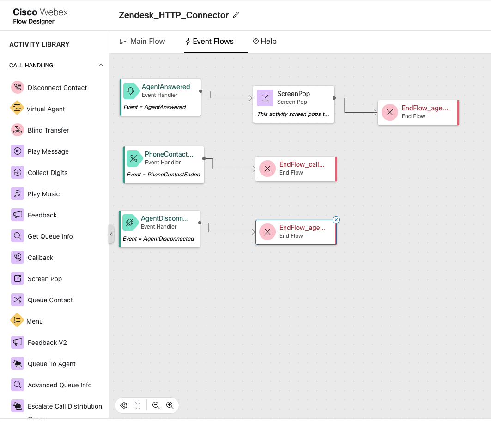

# Webex Contact Center - IVR HTTP Connector for Zendesk

The following section explains how to get started with the HTTP connector in Webex Contact Center that can interact with Zendesk, extract information and make routing decisions accordingly. Since all HTTP verbs are supported, you can securely extract and update the ticket / other object types inside of Zendesk with the help of this HTTP Connector.

**Attached**

- The sample flow for **Zendesk_HTTP_Connector.json** which shows how a simple lookup can be performed in an IVR flow. For detailed steps, refer the video link given below.
- The Postman collection **Zendesk REST APIs Sample.postman_collection.json** can be directly imported into Postman to understand the Zendesk REST APIs.

## [How to Configure Zendesk HTTP Connector on Webex Contact Center Flow Designer]()

## Use Case

- Customer calls into Webex Contact Center and is greeted while an ANI lookup is performed on Zendesk.
- Based on the ANI, user details are fetched from the Zendesk CRM.
- From Webex Contact Center, the Zendesk Ticket Number is looked up (based on the User ID) inside of the CRM and data is extracted.
- Customer is greeted with a personalized IVR.
- Customer is prioritized based on Incident severity.
- The call is routed to an agent.
- Last created ticket information is popped onto the agent's machine.
- Post call, information about the call, including call identifiers - are posted by Webex Contact Center using Event Flows.

## Pre-Requisites

- Enable API authentication on the Zendesk instance.
  Login to Zendesk instance -> Admin portal -> Apps and integrations -> APIs -> Zendesk API -> Toggle the button to enable API authentication using agent's email address and password. Attached is the screenshot for reference.
- Configuring the Zendesk connector using BasicAuth.
  Login to admin.webex.com to configure the connector
  admin.webex.com > Contact Center > Connectors > Select Custom Connector -> BasicAuth.
- Import the attached flow Zendesk_HTTP_Connector.json inside flow designer.
- Change the queueName, audio files etc in the IVR Flow as per your configurations.
  Follow the tutorial video for end-to-end sample configurations.

**Optional**
To explore and understand which REST APIs are supported with Zendesk, import the simplified Postman collection. These are the same APIs that will be used inside of WebexCC Flow Designer to interact with Zendesk.

**ServiceNow REST API Docs**

https://developer.zendesk.com/documentation/ticketing/getting-started/zendesk-api-quick-start
https://developer.zendesk.com/api-reference/ticketing/introduction

## Understanding the Sample Flow

### Section 1 : IVR lookup and Routing

- Within the IVR flow, a look is performed in the Zendesk CRM.
- This script has 3 HTTP nodes inside the main flow.
- First lookup gets the User ID of the Caller from the Zendesk CRM using the ANI.
- Second lookup fetches the last open ticket information using the User ID.
- Third HTTP request posts comment on the last created ticket.

### Section 2 : Screenpop on agent answer

- This section uses Event Flows to screenpop last created ticket information in a new browser tab on the agent's machine when the agent answers the call.
- This is just an example of what is possible on the Zendesk tickets via the Flow Designer.

