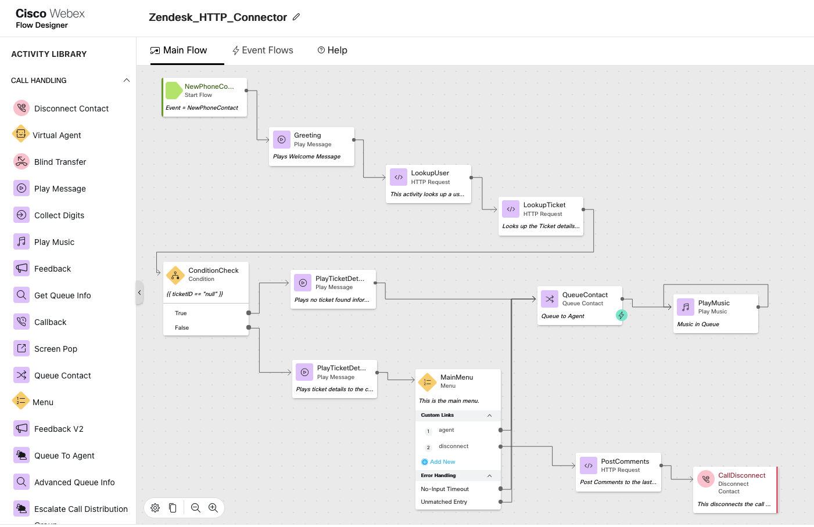
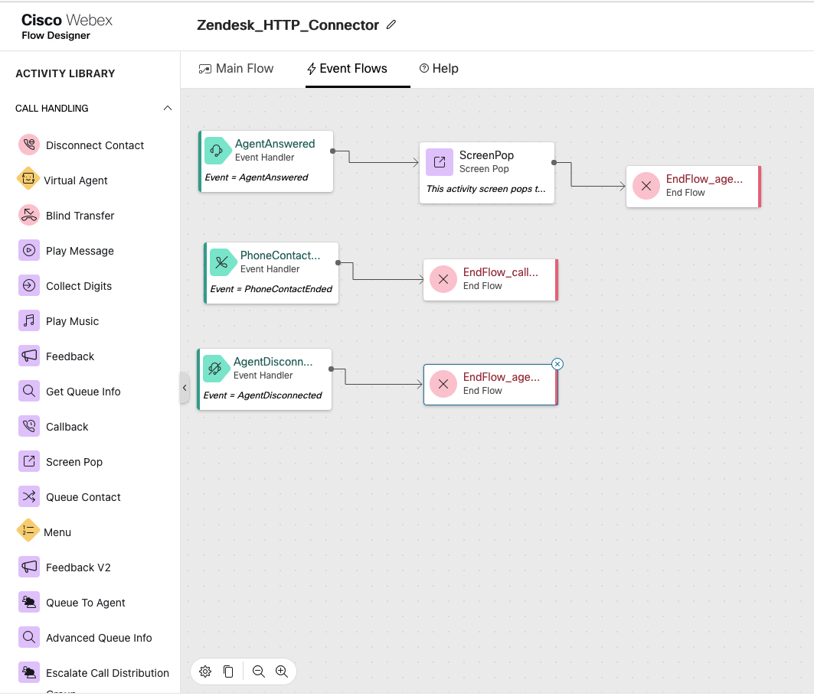

# Zendesk - IVR HTTP Connector

Reference assets for using the Webex Contact Center HTTP connector with Zendesk to perform IVR lookups, routing decisions, ticket updates, and screen pop actions. This folder includes a sample flow, a Postman collection, and screenshots of the sample setup.

## Included Assets

| Asset | Purpose |
| --- | --- |
| [`Zendesk_HTTP_Connector.json`](./Zendesk_HTTP_Connector.json) | Sample IVR flow showing Zendesk lookup behavior |
| [`Zendesk REST APIs Sample.postman_collection.json`](./Zendesk%20REST%20APIs%20Sample.postman_collection.json) | Postman collection for exploring the Zendesk APIs used in the sample |
| [`images/`](./images/) | Connector configuration and flow screenshots |

## Watch The Setup Video

- [How to Configure Zendesk HTTP Connector on Webex Contact Center Flow Designer](https://app.vidcast.io/share/4ee0bec7-a629-45a8-8bff-8df01b683163)

## Use Case

- Customer calls into Webex Contact Center and is greeted while an ANI lookup is performed on Zendesk.
- Based on ANI, user details are fetched from the CRM.
- The latest relevant Zendesk ticket is then looked up by using the user record.
- The caller receives a personalized IVR experience and is prioritized based on incident severity.
- The call is routed to an agent and the latest ticket is screen popped in a new browser tab.
- After the call, call details and identifiers are posted back to Zendesk through Event Flows.

## Prerequisites

- Enable API authentication on the Zendesk instance by going to `Admin portal > Apps and integrations > APIs > Zendesk API`.
- Configure the Zendesk connector using BasicAuth.
- In `admin.webex.com`, go to `Contact Center > Connectors`, select `Custom Connector`, and set `Authentication Type = BasicAuth`.
- Import `Zendesk_HTTP_Connector.json` into Flow Designer.
- Update the queue name, audio files, and other flow-specific values before testing.

## Optional API Exploration

- Import `Zendesk REST APIs Sample.postman_collection.json` into Postman to explore the APIs used by the sample flow.
- These are the same APIs used inside Webex Contact Center Flow Designer to interact with Zendesk.

## API References

- [Exploring Zendesk APIs with Postman](https://developer.zendesk.com/documentation/developer-tools/working-with-the-zendesk-apis/exploring-zendesk-apis-with-postman/)
- [Zendesk API quick start](https://developer.zendesk.com/documentation/ticketing/getting-started/zendesk-api-quick-start)
- [Zendesk ticketing API introduction](https://developer.zendesk.com/api-reference/ticketing/introduction/)

## Understanding The Sample Flow

### Section 1: IVR Lookup and Routing

- The IVR flow performs three HTTP requests against Zendesk.
- The first lookup gets the user ID of the caller by ANI.
- The second lookup fetches the last open ticket information by using that user ID.
- The third request posts a comment on the last created ticket.

### Section 2: Screen Pop on Agent Answer

- This section uses Event Flows to screen pop the last created ticket information in a new browser tab when the agent answers the call.
- It shows one example of how Flow Designer can update and open Zendesk ticket context for the agent.

